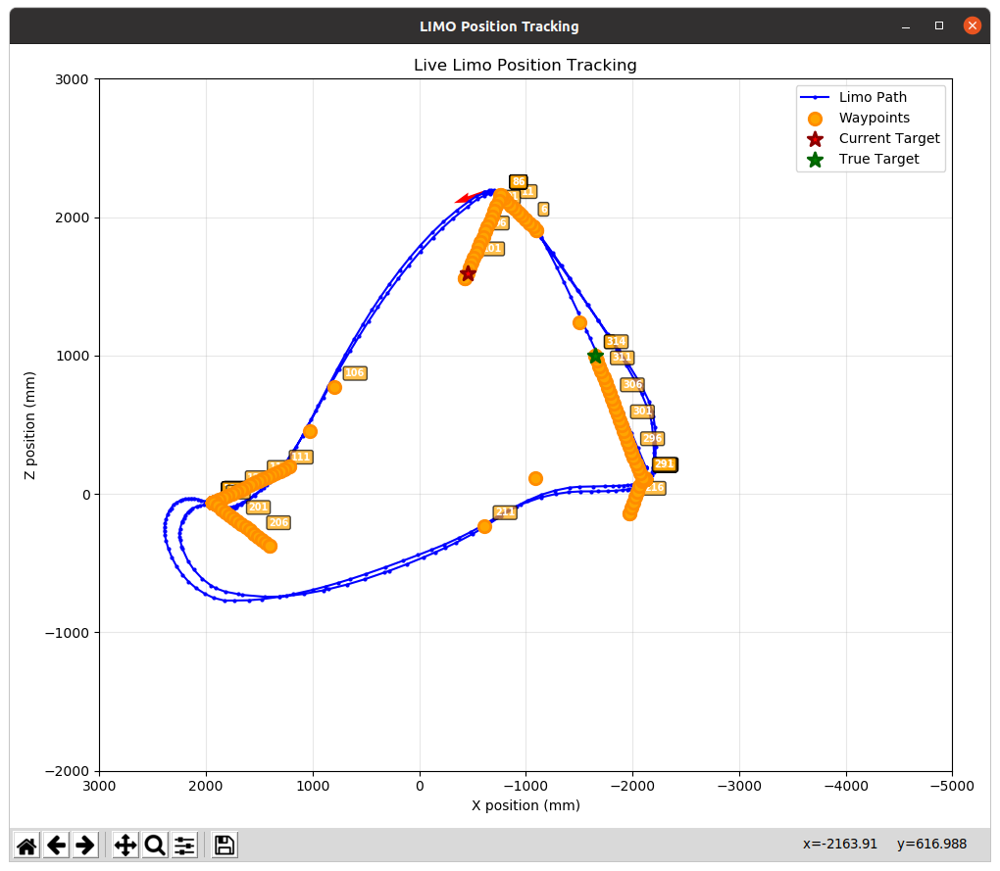
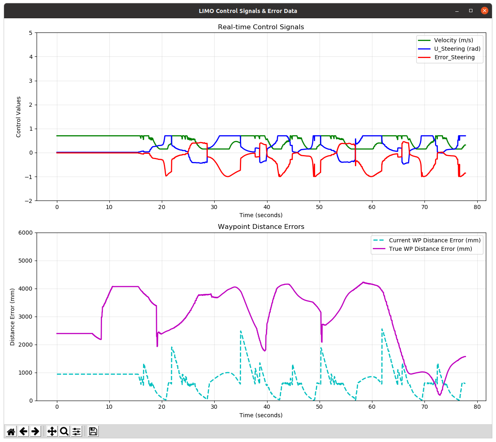
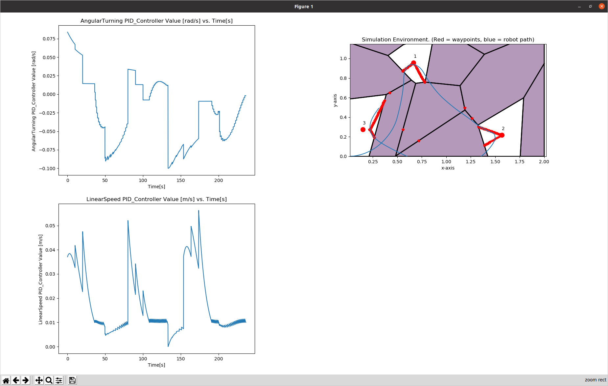

# 🤖 Real-World Trajectory Optimization & Tracking

Real-world deployment of **trajectory optimization and closed-loop trajectory tracking** on an AgileX LIMO mobile robot using **ROS1, OptiTrack, Python, and PID control**.

This project investigates the transition from simulation-based trajectory optimization to physical robot deployment, with a focus on **real-time trajectory tracking, feedback control, and sim-to-real performance**.

---

## 🛠️ Technologies

`Python` `ROS1` `ROS Noetic` `PID Control` `OptiTrack` `Trajectory Optimization` `NumPy` `Matplotlib` `Ubuntu`

---

## 🎯 Project Overview

The goal of this project was to deploy simulation-based trajectory optimization algorithms onto a physical **AgileX LIMO mobile robot** and evaluate how optimized trajectories perform in the real world.

Optimized reference trajectories are generated and sent to the robot for execution. During physical experiments, an **OptiTrack motion-capture system** provides real-time global pose measurements of the LIMO.

A **dual-PID controller** uses this feedback to continuously calculate tracking error and generate motion commands for the robot through ROS.

The complete control pipeline is:

```text
Trajectory Optimization
        │
        ▼
Reference Trajectory
        │
        ▼
Dual PID Controller
        │
        ▼
ROS Velocity Commands
        │
        ▼
AgileX LIMO
        │
        ▼
Physical Robot Motion
        │
        ▼
OptiTrack Pose Feedback
        │
        └──────────────► Tracking Error ──────► PID Controller
```

This architecture enables optimized trajectories developed in simulation to be tested and analyzed on a physical robotic platform.

---

## 📊 Experimental Results

### Trial 2 — Physical Robot Trajectory

The following world view shows the trajectory from one of the physical LIMO experiments.



### Trial 2 — Tracking Performance

The physical experiment was analyzed by comparing the reference trajectory with the robot's measured response.



The experiments demonstrated approximately **92% theoretical optimal-path efficiency**.

Analysis of the simulated and experimental trajectories identified approximately **8% sim-to-real trajectory deviation**.

A major source of this deviation was the difference between the idealized model used by the trajectory optimizer and the physical behavior of the LIMO robot.

---

## 🎥 Physical Robot Demonstrations

### Trial 2 — Real-World Trajectory Tracking

The following experiment shows the AgileX LIMO executing an optimized trajectory using closed-loop PID control and real-time OptiTrack feedback.


https://github.com/user-attachments/assets/5f85ac17-74d1-49ec-a623-80eeed8c4363


### Real-Time Robot Position Tracking

OptiTrack measurements are used to continuously update the estimated position of the physical robot during trajectory execution.

https://github.com/user-attachments/assets/c896f0bf-b022-49e9-b4f5-d4e4f733d3d9

---

## 🖥️ Simulation

Before physical deployment, the trajectory optimization and tracking algorithms were evaluated in simulation.



Simulation provided a controlled environment for testing trajectory generation and controller behavior before transferring the system to the physical LIMO.

---

## 🔬 Sim-to-Real Analysis

Deploying the trajectory optimization system on the physical robot revealed several differences between simulation and real-world execution.

Important sources of trajectory deviation included:

- Model mismatch between the trajectory optimizer and the physical robot
- Car-like steering and motion constraints of the LIMO platform
- Physical actuator limitations
- Sharp turns in optimized trajectories
- High-speed trajectory segments
- Communication and control-loop latency

The trajectory optimizer used a simplified representation of the robot, while the physical LIMO has real kinematic and actuator constraints.

As a result, trajectories that were feasible for the simulated model were not always followed perfectly by the physical platform.

These experiments demonstrate the importance of incorporating realistic robot dynamics and constraints when transferring trajectory optimization algorithms from simulation to real robotic systems.

---

## 🧠 Key Takeaways

This project provided hands-on experience with:

- Trajectory optimization
- Closed-loop trajectory tracking
- PID controller development and tuning
- Real-time feedback control
- ROS-based robot communication
- OptiTrack motion capture
- Robot pose estimation
- Experimental robotics
- Sim-to-real validation
- Robot data analysis and visualization
- Debugging physical robotic systems

---

## 🚀 Future Work

Potential improvements to the system include:

- Developing a trajectory model that more accurately represents the LIMO's car-like dynamics
- Incorporating physical steering and velocity constraints directly into trajectory optimization
- Exploring more advanced trajectory-tracking controllers
- Improving tracking performance through sharp turns
- Improving tracking during high-speed trajectory segments
- Further analyzing simulation-to-real-world discrepancies
- Evaluating additional optimized trajectories and operating conditions

---

## ⚙️ Setup & Running the Project

Detailed installation, environment setup, dependencies, and instructions for running the project can be found in:

### **[→ Setup Guide](SETUP.md)**

The project was developed using **ROS1 / ROS Noetic** and deployed on an **AgileX LIMO** with external pose feedback from **OptiTrack**.

---

## 📁 Repository Structure

```text
realworld_LIMO_hytoperm/
│
├── README.md
├── SETUP.md
├── .gitignore
│
├── assets/
│   ├── images/
│   │   ├── trial2_world.png
│   │   ├── trial2_graphs.png
│   │   └── simulation_zoomed.png
│   │
│   └── videos/
│       ├── trial2_run.mp4
│       └── live_robot_position.mp4
│
├── hytoperm_implinetation/
├── limo_tutorial/
└── vrpn_client_ros/
```

### `hytoperm_implinetation/`

Contains the trajectory optimization, simulation, and physical LIMO implementation.

### `limo_tutorial/`

Contains supporting LIMO ROS packages and configuration used to interface with the robot.

### `vrpn_client_ros/`

Provides the ROS interface used to receive pose information from the OptiTrack motion-capture system.

### `assets/`

Contains selected plots, experiment visualizations, and compressed demonstration videos used in this README.

---

## 👤 Author

**Justen Li**

M.S.E. Robotics — Johns Hopkins University  
B.S. Mechanical Engineering, Robotics Concentration — Boston University

Research focused on **robotics, autonomy, trajectory optimization, control, and sim-to-real deployment**.
